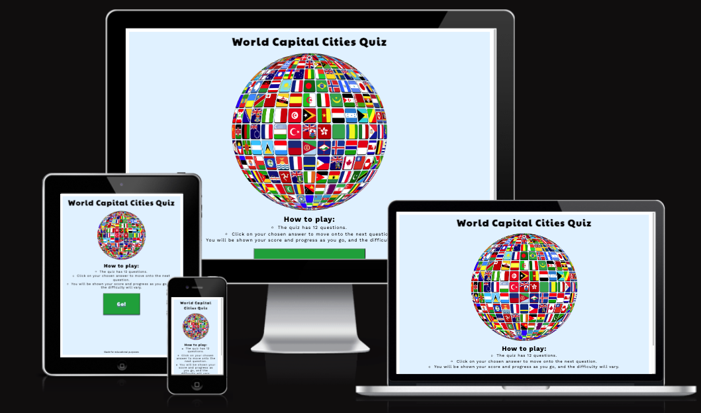
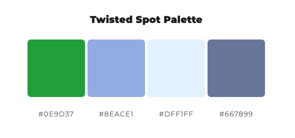
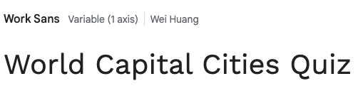
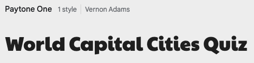
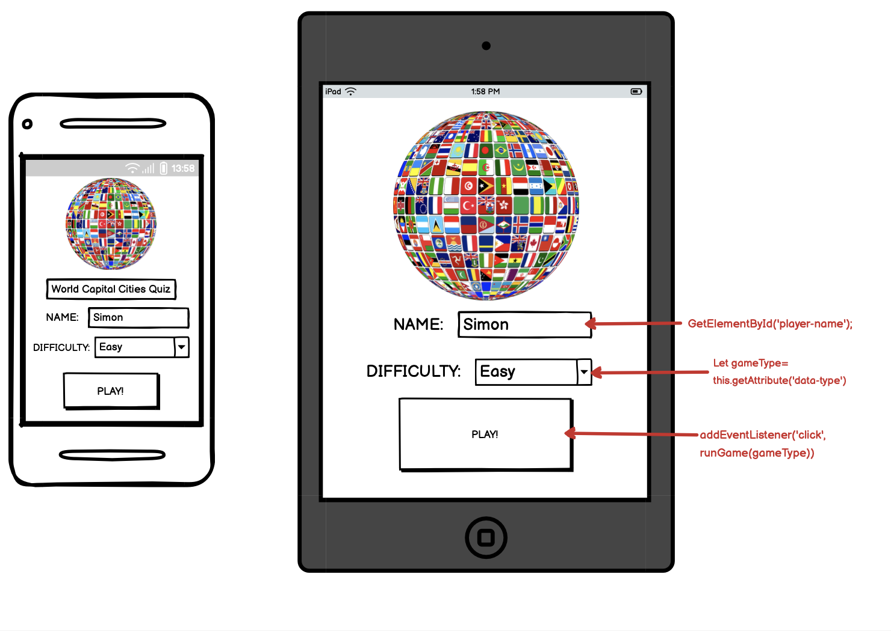
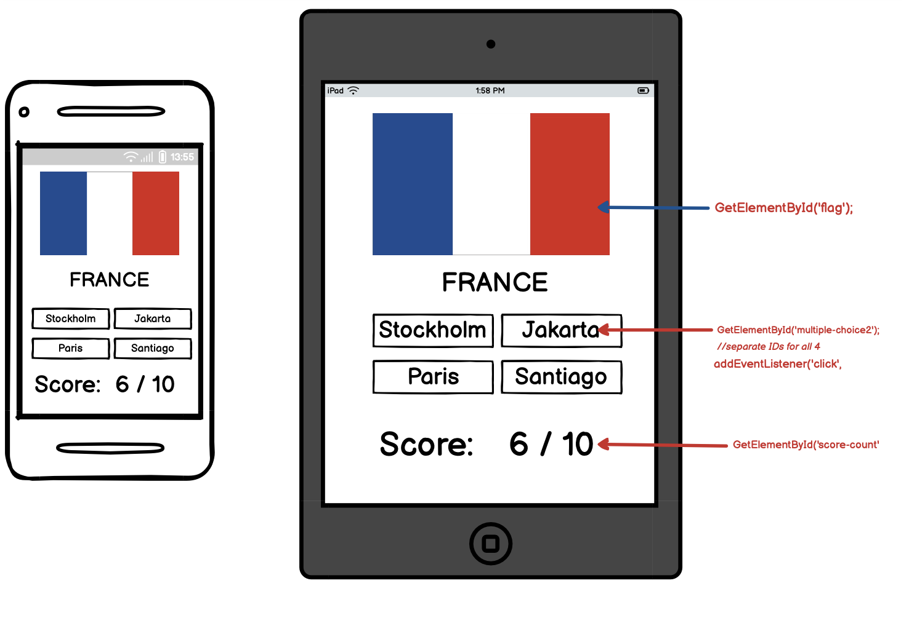
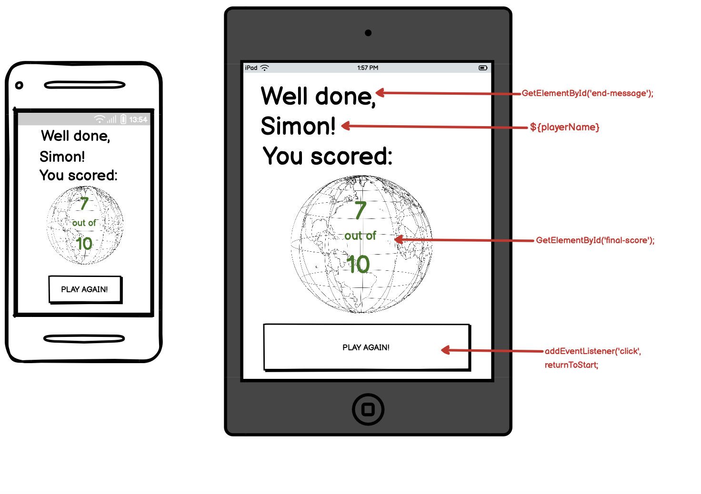
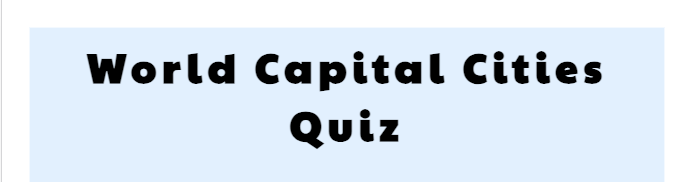
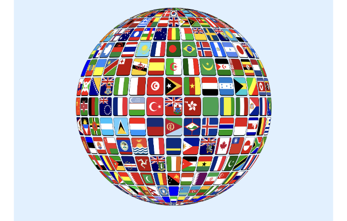

# World Capital Cities Quiz

Welcome! Capital Cities Quiz is a multiple choice quiz of world capital cities.

It is the second project for my Diploma in Full Stack Software Development, and utilises JavaScript to operate the quiz game, as well as HTML. CSS styling is also applied.

The quiz is designed so the order of questions is random, with a view to making it replayable.

The site is also responsive across all screen sizes.

The game is targeted at people who want to test their knowledge of capital cities, and is useful for this purpose.

It is also useful for those who want to test their capitals knowledge with a mixture of difficulty levels.

## User Experience (UX)

### User Demographic

The site is intended for:

- Web users everywhere who want to challenge themselves and test their knowledge of capital cities.
- Users who want to learn about international capital cities.
- Users who want to  play simple games online.

### User Stories

As a new user I want to:
- Engage in a test of knowledge of world capital cities.
- Try to score as highly as possible on the quiz.
- Be entertained for a period of time.

An an existing user I want to:
- Try to beat previous scores on the quiz.
- Refresh knowledge of global capital cities.
- Check back for any additions to the quiz's bank of questions.

## Design

World Capital Cities Quiz is designed to make it quick and easy for the user to launch the quiz, with minimal things to read on the home page/introduction screen before starting it - just a quick few points on instructions and what to expect.

There are three screens that the user sees. The intro screen (which effectively functions as a home page), the game screen which cycles through the questions, and the end screen.

Large button elements with drop shadow CSS styling applied appear on every screen of the quiz so the user knows where they are expected to tap/click.

Each screen has its own hero image (the globe of flags for the intro and end screens, and the cycled-through country flags for the game screen) in order to keep things colourful and engaging.

### Colour Scheme

A colour scheme was picked using the [Color Space](https://mycolor.space/) website.

These colours were picked due to their bearing similarity to colours often seen in maps or atlases - the blues for the sea/water, the green for land.

They are also intended to be light, clean and inoffensive colours that do not distract from the content of the quiz.

### Fonts

The two Google Fonts used on this site are Paytone One and Work Sans.

It's hoped they are clean, inviting fonts that do not look overly formal.

 

Paytone One is used for the title/logo in the header, all text that appears on buttons (the start button, the answer option buttons and the play again button), the end message generated based on score, and the final score number.

Work Sans is used for the intructions, the text in the footer, the text for each question, the progress tracker on the game screen, the score tracker on the game screen, and the text immediately above and below the final score number on the end screen ("You scored:" and "out of 12").

Letter spacing of 2 or 3 pixels is applied to all text on the site, apart from the text in the footer. The intention is to make the text easier to read and more pleasing on the eye.

## Wireframes

Wireframes were drawn up at the start to help with a rough plan for the layout of each screen (intro, game, end), and to brainstorm initial ideas on JavaScript functions/variables, and features of the site.

The wireframes covered the intended mobile apperance of the site, as well as tablet, with the idea that the latter set of styling would apply to all screen sizes from tablet up.

In the end, some features from the wireframes were ommited for simplicity - namely the inputting of the user's name and the selection of difficulty level.

## Features

### Existing Features

Screenshots in this section are from the mobile version of the site.

#### Header

- The header section encapsulates the site's main H1 heading reading 'World Capital Cities Quiz' that links back to the intro screen if tapped/clicked. It is visible on all screens.

#### Intro and End Screens Hero Image

- The intro and end screens both feature a main image of a flag made up of globes to add color in keeping with the site's subject matter.

#### Instructions

- The intro screen features a brief runthrough of instructions and what to expect in the quiz.

[Screen shot of instructions](assets/images/screenshots-for-readme/project-2-instructions-screenshot.png)

### Features Left To Implement

#### (++high score tracking feature, difficulty level++)

##Deployment

The site was set up by creating a new repository on GitHub, using this template from CodeInstitute.

The development environment used was GitPod. This was opened initially via the green 'GitPod' button that appeared on the repo's listing on GitHub.

The initial 'git add', 'git commit' and 'git push' were made on 17 September 2023. There have been over XX further commits since then.

The regular commits and pushes were sent from GitPod back to the repo on GitHub.

To deploy the live site from the GitHub repository, these steps as outlined on Code Institute's sample README file for the Love Running project were followed:

In the GitHub repository, navigate to the Settings tab
From the source section drop-down menu, select the Main Branch
Once the main branch has been selected, the page will be automatically refreshed with a detailed ribbon display to indicate the successful deployment.

## Technologies Used

(++list all++)

## Testing

(++browsers and screen sizes testing on++)

(++Try to use html markdown testing table this time++)

On each browser, in all display sizes/modes, all of the following were tested and confirmed as working:
(++list all features checked++)

Problems encountered in this phase included:
(++list main problems encountered and how they were fixed++)

### Validator Testing

(++WC3 for both HTML and CSS - with screenshots

JS Hint for JavaScript - with screenshots

Lighthouse - with screenshots++)

### Unfixed Bugs

## Credits

### Content
- I produced the written content, layout, colour scheme and design of the website.
- (++credit any sites where difficulty levels for capital cities were taken from++)
- Credit for quiz questions: https://www.sporcle.com/games/FilipinoBreloom/world-capitals-by-difficulty

### Media

(++source of photos++)

