# World Capital Cities Quiz

Welcome! Capital Cities Quiz is a multiple choice quiz of world capital cities.

It is the second project for my Diploma in Full Stack Software Development, and utilises JavaScript to operate the quiz game, as well as HTML. CSS styling is also applied.

The quiz is designed so the order of questions is random, with a view to making it replayable.

The site is also responsive across all screen sizes.

The game is targeted at people who want to test their knowledge of capital cities, and is useful for this purpose.

It is also useful for those who want to test their capitals knowledge with a mixture of difficulty levels.

This is a link to the deployed site: https://sjayawardena.github.io/p2-capital-cities-quiz/ 

## User Experience (UX)

### User Demographic

The site is intended for:

- Web users everywhere who want to challenge themselves and test their knowledge of capital cities.
- Users who want to learn about international capital cities.
- Users who want to  play simple games online.

### User Stories

As a new user I want to:
- Engage in a test of knowledge of world capital cities.
- Try to score as highly as possible on the quiz.
- Be entertained for a period of time.

An an existing user I want to:
- Try to beat previous scores on the quiz.
- Refresh knowledge of global capital cities.
- Check back for any additions to the quiz's bank of questions.

## Design

World Capital Cities Quiz is designed to make it quick and easy for the user to launch the quiz, with minimal things to read on the home page/introduction screen before starting it - just a quick few points on instructions and what to expect.

There are three screens that the user sees. The intro screen (which effectively functions as a home page), the game screen which cycles through the questions, and the end screen.

Large button elements with drop shadow CSS styling applied appear on every screen of the quiz so the user knows where they are expected to tap/click.

Each screen has its own hero image (the globe of flags for the intro and end screens, and the cycled-through country flags for the game screen) in order to keep things colourful and engaging.

### Colour Scheme

A colour scheme was picked using the [Color Space](https://mycolor.space/) website.

These colours were picked due to their bearing similarity to colours often seen in maps or atlases - the blues for the sea/water, the green for land.

They are also intended to be light, clean and inoffensive colours that do not distract from the content of the quiz.

### Fonts

The two Google Fonts used on this site are Paytone One and Work Sans.

It's hoped they are clean, inviting fonts that do not look overly formal.

 

Paytone One is used for the title/logo in the header, all text that appears on buttons (the start button, the answer option buttons and the play again button), the end message generated based on score, and the final score number.

Work Sans is used for the intructions, the text in the footer, the text for each question, the progress tracker on the game screen, the score tracker on the game screen, and the text immediately above and below the final score number on the end screen ("You scored:" and "out of 12").

Letter spacing of 2 or 3 pixels is applied to all text on the site, apart from the text in the footer. The intention is to make the text easier to read and more pleasing on the eye.

## Wireframes

Wireframes were drawn up at the start to help with a rough plan for the layout of each screen (intro, game, end), and to brainstorm initial ideas on JavaScript functions/variables, and features of the site.

The wireframes covered the intended mobile apperance of the site, as well as tablet, with the idea that the latter set of styling would apply to all screen sizes from tablet up.

In the end, some features from the wireframes were ommited for simplicity - namely the inputting of the user's name and the selection of difficulty level.

## Features

### Existing Features

#### Introduction Screen

- The introduction screen is the first screen the user sees, effectively acting as a home/landing page. The features of the intro screen are detailed below.

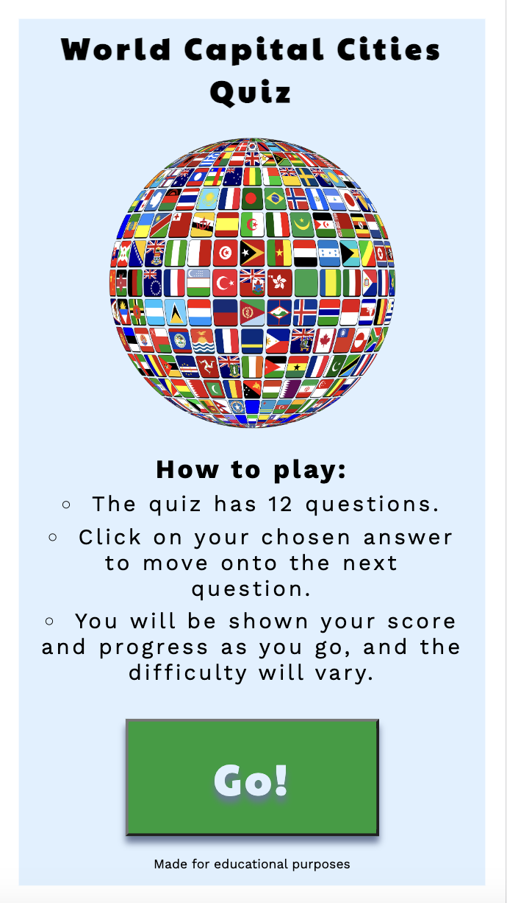

#### Header

- The header section encapsulates the site's main H1 heading reading 'World Capital Cities Quiz' that links back to the intro screen if tapped/clicked. It is visible on all screens.

#### Intro and End Screens Hero Image

- The intro and end screens both feature a main image of a flag made up of globes to add color in keeping with the site's subject matter.

#### Instructions

- The intro screen features a brief runthrough of instructions and what to expect in the quiz.

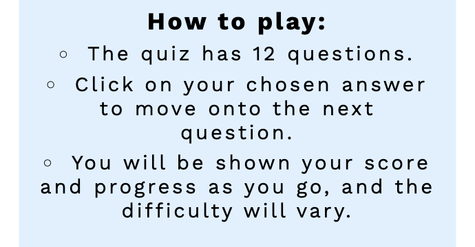

#### Start Quiz Button

- The button at the bottom of the intro screen (with "Go!" written on it) is used to begin the quiz.

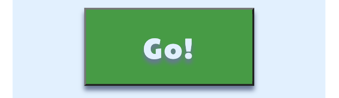

#### Footer

- The footer appears at the bottom of each screen, with small text making clear that the site has been made for educational purposes.

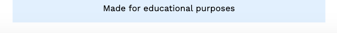

#### Game Screen

- The game screen appears after the intro screen, and cycles through all 12 of the quiz's questions. The features of the game screen are detailed below.

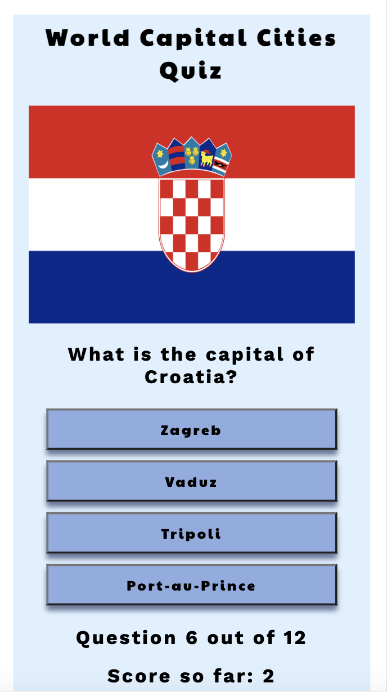

#### Game Screen Flag Hero Image

- The game screen features a hero image of the flag of the country to which the current question relates, and this image changes with each question.

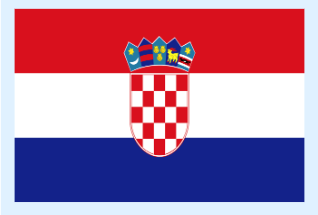

#### Current Question

- The current question on the game screen asks the user what the capital city is of the country randomly chosen from the 12 questions allowed for in the site's JavaScript.

#### Answer Options and Ensuing Feedback

- There are four answer options for each question, each displayed via a button that the user can press to select their answer. Doing this brings up an alert to tell them whether their answer was right or wrong. All are screenshotted here.

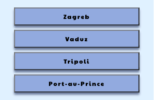

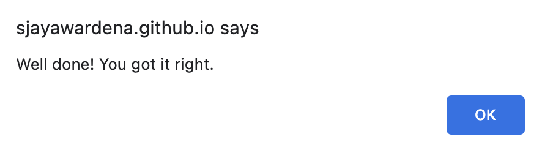

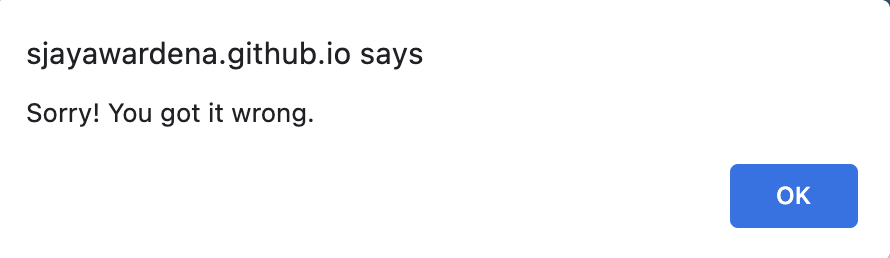

#### Progress and score tracker

- Underneath the answer options, there is a progress tracker that tells the user how many questions out of 12 they have answered, and a score tracker that tells them how many they have got right so far.

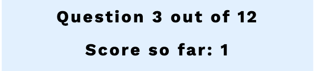

#### End screen

- The end screen is the last screen that the user sees, and appears at the end of the quiz. The features of the end screen are detailed below.

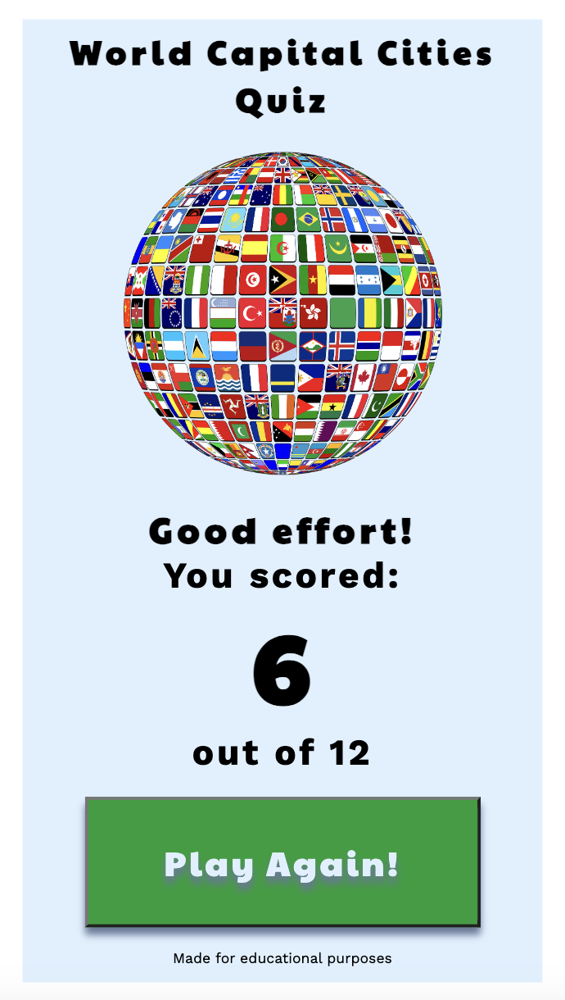

#### Final Score and End Message

- Underneath the end screen hero image detailed already, the user is shown their final score out of 12, along with a message approriate to their score range. 
- The message for a score between 1 and 4 is: "Tough luck!" 
- The message for a score between 5 and 8 is: "Good effort!"
- The message for a score between 9 and 12 is: "Well done! 

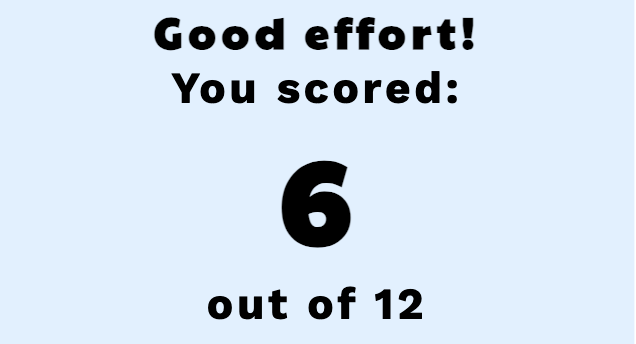

#### Play Again Button

- The button at the bottom of the end screen (with "Play Again!" written on it) is used to restart the quiz by taking the user back to the intro screen.

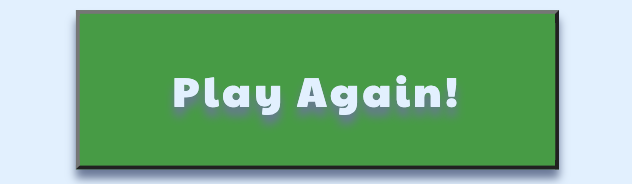

### Features Left To Implement

#### High Score Tracking

- I would like the site to be able to track the user's previous highest score, so they could try to beat it.

#### Larger Question Bank

- A much larger bank of countries/cities to be randomly picked for the quiz's 12 questions would give it much more replayability. 

#### Select Difficulty

- This would depend on the larger question bank feature also being implemented. Users would be able to set the difficulty level of the quiz at the start, depending how much of a challenge they want.

## Deployment

The site was set up by creating a new repository on GitHub, using this template from CodeInstitute.

The development environment used was GitPod. This was opened initially via the green 'GitPod' button that appeared on the repo's listing on GitHub.

The initial 'git add', 'git commit' and 'git push' were made on 17 September 2023. There have been nearly 70 further commits since then.

The regular commits and pushes were sent from GitPod back to the repo on GitHub.

To deploy the live site from the GitHub repository, these steps as outlined on Code Institute's sample README file for the Love Running project were followed:

- In the GitHub repository, navigate to the Settings tab
- From the source section drop-down menu, select the Main Branch
- Once the main branch has been selected, the page will be automatically refreshed with a detailed ribbon display to indicate the successful deployment.

## Technologies Used

- HTML5 - to code for each page.
- CSS - to style each page.
- JavaScript - to program all elements of how the quiz functions and moves through screens.
- [Github](https://github.com/) - to create and store the repository for the website.
- [GitPod](https://www.gitpod.io/) - the Integrated Development Environment (IDE) used to build the site, and to 'git commit' and 'git push' back to the Github repository.
- [Balsamiq](https://balsamiq.com/wireframes/) - Application used on Mac to create wireframes.
- [Google Fonts](https://fonts.google.com/) - both fonts used in this project were chosen via Google Fonts and linked to at the top of the 'style.css' file.
- [icons8 website](https://icons8.com/) - the favicons were downloaded from here.
- [Color Space website](https://mycolor.space) - used to select colour scheme.
- [Pixabay website](https://pixabay.com/) - royalty-free flag images vector art images were downloaded from here for use during the quiz, as well as the start and end screen globe-of-flags hero image.
- [Chrome DevTools](https://developer.chrome.com/docs/devtools/) - used to inspect the website and its performance at every step of development.
- [Lighthouse](https://developer.chrome.com/docs/lighthouse/overview/) - used to assess the overall quality of the site.
- [W3C Markup Validation site](https://validator.w3.org/) - used to find issues in the html for the site and to resolve them 
- [W3C CSS Validation site](https://jigsaw.w3.org/css-validator/) - used to find issues in the CSS for the site and to resolve them.
- [JS Hint validation site](https://jshint.com/) - used to find issues in the JavaScript for the site and to resolve them.
- [Am I Responsive? site](https://ui.dev/amiresponsive) - used to generate screenshots of the site across different devices and screen sizes.

## Testing

The website was tested on the Chrome, Safari and Firefox browsers. On each browser, it was inspected in mobile view (including iPhone SE and Galaxy Fold), and the the view styled for tablet and up (600px width and up).

On each browser, in all display sizes/modes, all of the following have been tested and confirmed as working:
- The intro, game and end screens all appear as expected with all features and styling present.
- The header appears on every screen - intro, game and end - and the logo/title can be tapped/clicked to return to the intro screen.
- The hero image of the intro and end screen appears as expected.
- The instructions on the intro screen appear as expected.
- The start game button successfully progresses the user to the game screen and begins the quiz.
- The footer appears on every screen -  intro, game and end - including the text within it.
- The correct flag image appears for each country/question on the game screen.
- The text of each question on the game screen is correct and appears alongside the expected flag and answer options.
- The answer options on the game screen all work when pressed/clicked, and the JavaScript functions mean they give the user the right feedback about whether their answer was correct or incorrect.
- The progress tracker on the game screen correctly increases by 1 throughout the quiz up to question 12.
- The score tracker on the game screen correctly increments by 1 every time the user achieves a correct answer.
- The end message on the end screen generates as expected based on score ranges.
- The final score on the end screen is correct at the end of the quiz.
- The play again button on the end screen brings the user back to the intro screen to start the quiz again.

Problems encountered in testing phases - both at the end of the process and at various stages during the process - include:
- The answer checking JavaScript functions were not working beyond the first question. This was found to be happening because four variables in script.js - 'selectedAnswer1 = answer1Text.innerText', 'selectedAnswer2 = answer2Text.innerText', 'selectedAnswer3 = answer3Text.innerText', and 'selectedAnswer4 = answer4Text.innerText' - were wrongly being declared outside the relevant functions for checking all four answer options in the quiz. Once they were moved to be declared inside these functions - 'answer1Selected()', 'answer2Selected()', 'answer3Selected()', and 'answer4Selected()' - the quiz then worked as expected, with the correct feedback given on all answer options for each question.
- When the correct answer was selected on the questions for Egypt, The Philippines or Burkina Faso, the quiz did not successfully progress to the next question. This was found to be because the 'nextQuestion()' function was being called too early within the 'answer3Selected()' and 'answer4Selected()' functions. Once it was moved outside the curly braces it was on, the problem stopped happening.
- The first question did not always successfully move onto the second after the answer was selected. When this stopped happening, I realised the issue only occurred when the first question was Egypt, The Philippines or Burkina Faso, and so the fix to the previous issue also fixed this.
- There was an issue with the flag images for the UK and the USA questions, which are slighly different dimensions to the other flag images, overflowing off the edge of the screen. Changing the CSS styling to 'max-width: 100%' for the flag images fixed this, and stopped the 2 in question overflowing their divs.
- The background colour was not covering the whole screen. This was because it had been applied to the intro, game and end screens' section elements, rather than to the body element. Applying the background colour and appropriate CSS styling to the body element fixed this issue.

### Validator Testing

The site's script.js JavaScript file passed through [JS Hint](https://jshint.com/) validator service successfully. The only issues displayed were because JS Hint could not see the contents of adjacent files in the repository, and so:
- The warnings about the 'quizQuestions' variable not being defined did not need to be addressed, because the variable is defined in the repository's 'set-questions.js' file. The quiz's functioning is proof of this file being successfully detected and by extension the quizQuestions variable being adequately defined.
- The six 'unused variables' it points out are functions that are defined within script.js, but not called within script.js. This is because they are instead successfully called via 'onclick' listener attributes in the project's index.html file. But JS Hint cannot see the contents of this. Adding event listeners within script.js would stop JS Hint throwing up this issue. For example, regarding the function for checking answer 1 when selected, this event listener could be applied: 'answer1Text.addEventListener("click", answer1Selected())'. And so on for 2, 3 and 4. But this is not required, because instead the onclick listeners in the project's index.html work as expected.

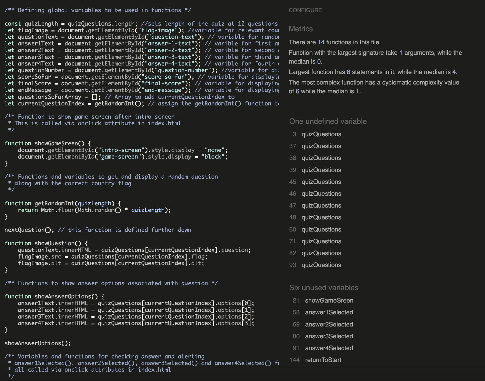

The site's style.css has passed through the [W3C validation](https://validator.w3.org/) process.
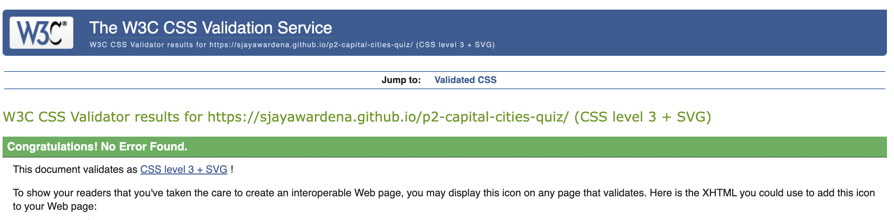

(++WC3 for both HTML and CSS - with screenshots

Lighthouse - with screenshots++)

### Unfixed Bugs

## Credits

### Content
- I produced the written content, layout, colour scheme and design of the website.
- (++credit any sites where difficulty levels for capital cities were taken from++)
- Credit for quiz questions: https://www.sporcle.com/games/FilipinoBreloom/world-capitals-by-difficulty

### Media

(++source of photos++)

